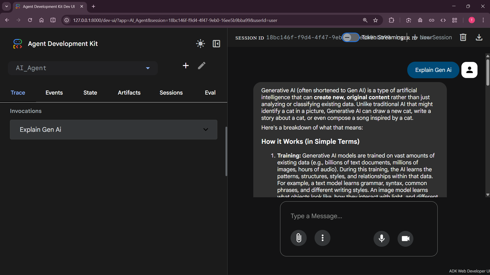

#  AI Chatbot using Google ADK

An intelligent AI chatbot built using **Google ADK (Agent Development Kit)** that can interact with users and generate intelligent responses.
This project demonstrates how to build an AI-powered conversational agent using modern agent frameworks.

The chatbot processes user queries and generates meaningful responses using AI models, making it useful for learning **AI agents, conversational AI, and LLM-based applications**.

---

##  Features

*  AI-powered chatbot
*  Built using **Google ADK**
*  Real-time conversational responses
*  Intelligent query understanding
*  Demo screenshot included
*  Simple and modular project structure

---

##  Project Structure

```
Open_AI/
│
├── AI_Agent/        # Chatbot implementation using Google ADK
├── contains.txt     # Sample input / text file used in the project
├── Demo.png         # Demo screenshot of chatbot working
├── .gitignore       # Files ignored by Git
└── README.md        # Project documentation
```

---

##  Installation

Clone the repository:

```bash
git clone https://github.com/your-username/repository-name.git
cd repository-name
```

Create a virtual environment:

```bash
python -m venv venv
```

Activate the virtual environment

**Windows**

```bash
venv\Scripts\activate
```

Install dependencies:

```bash
pip install -r requirements.txt
```

---

##  Run the Chatbot

Navigate to the chatbot directory and run the main script:

```bash
adk web
```

The chatbot will start and you can begin interacting with it through the terminal.

---

##  Demo Code

Below is a simple example of how the chatbot interacts with the user.

```python
import google.generativeai as genai

genai.configure(api_key="YOUR_API_KEY")

model = genai.GenerativeModel("gemini-pro")

print("AI Chatbot started. Type 'exit' to stop.\n")

while True:
    user_input = input("You: ")

    if user_input.lower() == "exit":
        print("Chatbot: Goodbye!")
        break

    response = model.generate_content(user_input)
    print("Chatbot:", response.text)
```

This script creates a simple chatbot loop where:

1. The user enters a message
2. The message is sent to the AI model
3. The model generates a response
4. The chatbot prints the response

---

##  Demo Screenshot

Below is a screenshot of the chatbot in action.



---

##  Technologies Used

* Python
* Google ADK (Agent Development Kit)
* Generative AI models
* Git & GitHub for version control

---

##  Learning Outcomes

This project helps understand:

* Building **AI agents**
* Working with **Google ADK**
* Designing conversational AI systems
* Structuring AI projects for GitHub
* Managing Python environments

---

##  License

This project is created for **learning and educational purposes**.

---

##  Author

Developed by **Syam Kumar**
AI & Machine Learning Enthusiast
